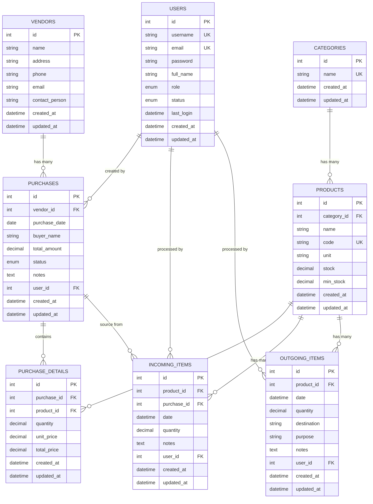

# Vadhana Warehouse Management System


## Deskripsi Umum

Vadhana Warehouse Management System adalah aplikasi web yang dibangun menggunakan framework **CodeIgniter 4** untuk mengelola operasional gudang dengan efisien. Aplikasi ini menyediakan fitur lengkap untuk mencatat keluar masuk barang, memantau stok barang secara real-time, dan menghasilkan laporan yang berguna untuk pengambilan keputusan.

### 🎯 Tujuan Aplikasi
- Mencatat transaksi keluar masuk barang dengan akurat
- Memantau stok barang yang tersedia di gudang
- Mencegah stok barang menjadi minus
- Menghasilkan laporan komprehensif untuk analisis bisnis
- Meningkatkan efisiensi operasional gudang

---

## 📁 Struktur Proyek

```
warehouse-management/
├── app/
│   ├── Config/
│   │   ├── Database.php            # Konfigurasi database
│   │   ├── Routes.php              # Routing aplikasi
│   │   ├── Migrations.php          # Konfigurasi migrasi
│   │   └── ...
│   ├── Controllers/
│   │   ├── Auth.php                # Autentikasi pengguna
│   │   ├── Dashboard.php           # Halaman utama
│   │   ├── Categories.php          # Manajemen kategori
│   │   ├── Products.php            # Manajemen produk
│   │   ├── Vendors.php             # Manajemen vendor
│   │   ├── Purchases.php           # Manajemen pembelian
│   │   ├── IncomingItems.php       # Transaksi barang masuk
│   │   ├── OutgoingItems.php       # Transaksi barang keluar
│   │   └── Reports.php             # Laporan sistem
│   ├── Models/
│   │   ├── UserModel.php           # Model pengguna
│   │   ├── CategoryModel.php       # Model kategori
│   │   ├── ProductModel.php        # Model produk
│   │   ├── VendorModel.php         # Model vendor
│   │   ├── PurchaseModel.php       # Model pembelian
│   │   ├── PurchaseDetailModel.php # Model detail pembelian
│   │   ├── IncomingItemModel.php   # Model barang masuk
│   │   └── OutgoingItemModel.php   # Model barang keluar
│   ├── Views/
│       ├── layouts/                # Template layout
│       ├── auth/                   # Halaman autentikasi
│       ├── dashboard/              # Halaman dashboard
│       ├── categories/             # Halaman kategori
│       ├── products/               # Halaman produk
│       ├── vendors/                # Halaman vendor
│       ├── purchases/              # Halaman pembelian
│       ├── incoming_items/         # Halaman barang masuk
│       ├── outgoing_items/         # Halaman barang keluar
│       └── reports/                # Halaman laporan
├── public/                         # Asset publik (CSS, JS, images)
├── writable/                       # Folder writable
├── vendor/                         # Dependencies Composer
├── .env                            # Environment variables
├── composer.json                   # Composer configuration
└── README.md                       # Dokumentasi ini
```

---

## ⚡ Penjelasan Fitur

### 1. 📦 Manajemen Data Barang
- **CRUD Lengkap**: Admin dapat menambahkan, mengedit, dan menghapus data barang
- **Kontrol Stok**: Sistem mencegah stok barang menjadi minus
- **Data Komprehensif**: Setiap barang memiliki informasi:
  - Nama barang
  - Kode barang (auto-generated atau manual)
  - Kategori barang
  - Satuan (unit)
  - Jumlah stok saat ini
  - Minimum stok untuk alert

### 2. 🏷️ Manajemen Kategori Barang
- **CRUD Kategori**: Admin dapat mengelola kategori barang secara penuh
- **Fleksibilitas**: Dapat menambah kategori custom sesuai kebutuhan

### 3. 🛒 Manajemen Pembelian/Purchase
- **CRUD Pembelian**: Admin dapat mengelola data pembelian
- **Data Pembelian Lengkap**:
  - Informasi vendor (nama, alamat)
  - Tanggal pembelian
  - Nama pembeli
  - Detail barang yang dibeli (dengan quantity dan harga)
  - Status pembelian (pending/completed)
  - Total nilai pembelian

### 4. 📥 Transaksi Barang Masuk
- **Pencatatan Terstruktur**: Admin dapat mencatat transaksi barang masuk
- **Validasi Purchase**: Transaksi barang masuk harus berasal dari pembelian yang valid
- **Kontrol Quantity**: Jumlah barang masuk tidak boleh melebihi yang dibeli
- **Update Otomatis**: Stok barang bertambah otomatis setelah transaksi berhasil
- **Audit Trail**: Setiap transaksi tercatat dengan user yang melakukan

### 5. 📤 Transaksi Barang Keluar
- **Pencatatan Pengeluaran**: Admin dapat mencatat transaksi barang keluar
- **Validasi Stok**: Sistem mencegah pengeluaran melebihi stok yang tersedia
- **Update Otomatis**: Stok barang berkurang otomatis setelah transaksi
- **Informasi Tujuan**: Mencatat tujuan dan keperluan barang keluar

### 6. 📊 Sistem Laporan
Admin dapat mengakses berbagai laporan:
- **Laporan Barang Masuk**: Berdasarkan rentang tanggal tertentu
- **Laporan Barang Keluar**: Berdasarkan rentang tanggal tertentu
- **Laporan Stok Terkini**: Menampilkan stok real-time semua barang
- **Alert Stok Rendah**: Notifikasi barang dengan stok di bawah minimum
- **Laporan Purchase**: Analisis pembelian dan vendor
- **Export**: Laporan dapat diekspor ke format Excel/PDF

### 7. 🔐 Sistem Autentikasi & Autorisasi
- **Multi-Role**: Admin dan Operator dengan hak akses berbeda
- **Session Management**: Keamanan session yang robust
- **Password Encryption**: Password ter-hash dengan algoritma bcrypt
- **Profile Management**: User dapat mengelola profil mereka

---

## 🗄️ Desain ERD (Entity Relationship Diagram)



---

## 🚀 Petunjuk Instalasi & Setup Project

### Prasyarat Sistem
- **PHP**: 7.4 atau lebih tinggi
- **MySQL**: 5.7 atau lebih tinggi / MariaDB 10.3+
- **Composer**: Package manager untuk PHP
- **Web Server**: Apache/Nginx

### Langkah Instalasi

#### 1. Clone Repository
```bash
git clone https://github.com/nurfznhnf/Web-Warehouse.git
cd Web-Warehouse
```

#### 2. Install Dependencies
```bash
composer install
```

#### 3. Konfigurasi Environment
```bash
# Copy file environment
cp env .env

# Edit file .env
nano .env
```

Konfigurasi `.env`:
```env
#--------------------------------------------------------------------
# ENVIRONMENT
#--------------------------------------------------------------------
CI_ENVIRONMENT = development

#--------------------------------------------------------------------
# APP
#--------------------------------------------------------------------
app.baseURL = 'http://localhost:8080/'
app.sessionDriver = 'CodeIgniter\Session\Handlers\FileHandler'
app.sessionCookieName = 'warehouse_session'
app.sessionSavePath = WRITEPATH . 'session'

#--------------------------------------------------------------------
# DATABASE
#--------------------------------------------------------------------
database.default.hostname = localhost
database.default.database = your_database
database.default.username = root
database.default.password = 
database.default.DBDriver = MySQLi
database.default.DBPrefix =
database.default.port = 3306
```

#### 4. Setup Database
```bash
# Buat database MySQL
CREATE DATABASE your_database;
EXIT;

# Download dan Import file sql
# Link: https://drive.google.com/drive/folders/11nlgrY59WidBzfk-HkGrvpDZQcGkuGcD?hl=id
# 1. Buka link di atas
# 2. Download file warehouse_management.sql
# 3. Simpan di folder project Anda

# Import file SQL ke database
# 1. Buka phpMyAdmin
# 2. Pilih database your_database
# 3. Klik tab "Import"
# 4. Pilih file vadhana.sql
# 5. Klik "Go"
```

#### 5. Jalankan Aplikasi
```bash
# Development server
php spark serve
```

#### 6. Login Default
```
Username: admin@example.com
Password: password
```

---

## 🛠️ Tantangan Selama Pengerjaan dan Cara Menyelesaikannya

### 1. **Manajemen Stok Real-time**
**Tantangan**: Menjaga konsistensi stok saat ada transaksi bersamaan (concurrent transactions).

**Solusi**:
- Implementasi database transactions untuk memastikan ACID compliance
- Menggunakan row-level locking pada table products
- Validasi stok sebelum setiap transaksi
```php
// Contoh implementasi di IncomingItemModel
$this->db->transStart();
try {
    // Lock row untuk mencegah race condition
    $product = $this->db->table('products')
                       ->where('id', $productId)
                       ->get()
                       ->getRow();
    
    // Update stok
    $newStock = $product->stock + $quantity;
    $this->db->table('products')
             ->where('id', $productId)
             ->update(['stock' => $newStock]);
             
    $this->db->transComplete();
} catch (Exception $e) {
    $this->db->transRollback();
    throw $e;
}
```

### 2. **Validasi Business Logic Kompleks**
**Tantangan**: Memastikan barang masuk tidak melebihi quantity yang dibeli.

**Solusi**:
- Membuat method validasi khusus di model
- Implementasi business rules di service layer
- Menggunakan database constraints sebagai safety net
```php
public function validateIncomingQuantity($purchaseId, $productId, $quantity) {
    $totalPurchased = $this->db->table('purchase_details')
                              ->where('purchase_id', $purchaseId)
                              ->where('product_id', $productId)
                              ->selectSum('quantity')
                              ->get()
                              ->getRow()->quantity;
                              
    $totalReceived = $this->db->table('incoming_items')
                             ->where('purchase_id', $purchaseId)
                             ->where('product_id', $productId)
                             ->selectSum('quantity')
                             ->get()
                             ->getRow()->quantity;
                             
    return ($totalReceived + $quantity) <= $totalPurchased;
}
```

### 3. **Session Management & Security**
**Tantangan**: Mengelola session user dan mencegah unauthorized access.

**Solusi**:
- Implementasi custom filter untuk authentication
- Session timeout yang configurable
- CSRF protection untuk semua form
```php
// File: app/Filters/Auth.php
public function before(RequestInterface $request, $arguments = null)
{
    if (!session()->get('logged_in')) {
        return redirect()->to('/auth/login')
                        ->with('error', 'Silakan login terlebih dahulu');
    }
    
    // Check role-based access
    if ($arguments && !in_array(session()->get('role'), $arguments)) {
        throw new \CodeIgniter\Exceptions\PageNotFoundException();
    }
}
```

### 4. **Reporting & Export Functionality**
**Tantangan**: Menggenerate laporan dengan data yang besar dan format yang beragam.

**Solusi**:
- Implementasi lazy loading untuk data report
- Menggunakan library PhpSpreadsheet untuk export Excel
- Chunking data untuk memory efficiency
```php
public function exportToExcel($startDate, $endDate) {
    $spreadsheet = new \PhpOffice\PhpSpreadsheet\Spreadsheet();
    $sheet = $spreadsheet->getActiveSheet();
    
    // Set headers
    $sheet->setCellValue('A1', 'Tanggal');
    $sheet->setCellValue('B1', 'Produk');
    // ... other headers
    
    // Process data in chunks to avoid memory issues
    $offset = 0;
    $limit = 1000;
    $row = 2;
    
    do {
        $data = $this->getReportData($startDate, $endDate, $limit, $offset);
        foreach ($data as $item) {
            $sheet->setCellValue('A' . $row, $item['date']);
            $sheet->setCellValue('B' . $row, $item['product_name']);
            // ... other data
            $row++;
        }
        $offset += $limit;
    } while (count($data) === $limit);
    
    return $spreadsheet;
}
```

---

## 👥 Tim Pengembang

- **Fullstack Developer**: [Nurfauzan Hanif]

---

## 📞 Kontak & Support

- **Email**: nrfznhnf@gmail.com

**Happy coding! 🚀**